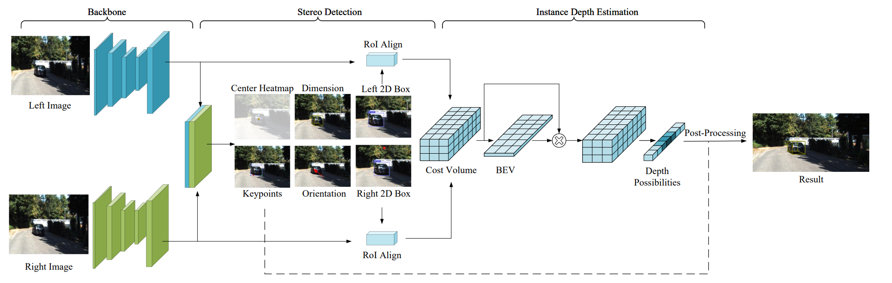

# SIDE: Center-based Stereo 3D Detector with Structure-aware Instance Depth Estimation

The source code of our work **"SIDE: Center-based Stereo 3D Detector with Structure-aware Instance Depth Estimation"**, accepted to WACV 2022
 

## Installation

### Requirements
- Python >= 3.6 
- PyTorch >= 1.2
- [COCOAPI](https://github.com/cocodataset/cocoapi)
- [DCNv2](https://github.com/CharlesShang/DCNv2/tree/pytorch_0.4)

## Data Preparation

### KITTI
Download the train-val split of [3DOP](https://xiaozhichen.github.io/files/mv3d/imagesets.tar.gz) and [SubCNN](https://github.com/tanshen/SubCNN/tree/master/fast-rcnn/data/KITTI) and place the data as below
```
  ${SIDE_ROOT}
  |-- data
  `-- |-- kitti
      `-- |-- training
          |   |-- image_2
          |   |-- label_2
          |   |-- calib
          |-- ImageSets_3dop
          |   |-- test.txt
          |   |-- train.txt
          |   |-- val.txt
          |   |-- trainval.txt
          `-- ImageSets_subcnn
              |-- test.txt
              |-- train.txt
              |-- val.txt
              |-- trainval.txt
```

## Training
To train the kitti 3D object detection with dla on 4 GPUs, run

~~~
python testTrain.py stereo --exp_id sub_dla34 --dataset kitti --kitti_split subcnn --batch_size 16 --num_epochs 70 --lr_step 45,60 --gpus 0,1,2,3
~~~

By default, pytorch evenly splits the total batch size to each GPUs. `--master_batch` allows using different batchsize for the master GPU, which usually costs more memory than other GPUs. If it encounters GPU memory out, using slightly less batch size with the same learning is fine.

If the training is terminated before finishing, you can use the same commond with `--resume` to resume training. It will found the lastest model with the same `exp_id`.

## Evaluation
To evaluate the kitti dataset, first compile the evaluation tool (from [here](https://github.com/prclibo/kitti_eval)):

~~~
cd SIDE_ROOT/src/tools/kitti_eval
g++ -o evaluate_object_3d_offline evaluate_object_3d_offline.cpp -O3
~~~

Then run the evaluation with pretrained model:

~~~
python testVal.py stereo --exp_id sub_dla34 --dataset kitti --kitti_split 3dop --resume
~~~

to evaluate the 3DOP split. For the subcnn split, change `--kitti_split` to `subcnn` and load the corresponding models.

## License

SIDE itself is released under the MIT License (refer to the LICENSE file for details).
Portions of the code are borrowed from [CenterNet](https://github.com/xingyizhou/CenterNet)(anchor-free design), [Stereo-RCNN](https://github.com/HKUST-Aerial-Robotics/Stereo-RCNN)(geometric constraint), [DCNv2](https://github.com/CharlesShang/DCNv2)(deformable convolutions) and [kitti_eval](https://github.com/prclibo/kitti_eval) (KITTI dataset evaluation). Please refer to the original License of these projects (See [NOTICE](NOTICE)).

## Reference

If you find our work useful in your research, please consider citing our [paper](https://arxiv.org/pdf/2108.09663.pdf):
```
@article{peng2021side,
  title={SIDE: Center-based Stereo 3D Detector with Structure-aware Instance Depth Estimation},
  author={Peng, Xidong and Zhu, Xinge and Wang, Tai and Ma, Yuexin},
  journal={arXiv preprint arXiv:2108.09663},
  year={2021}
}
```
